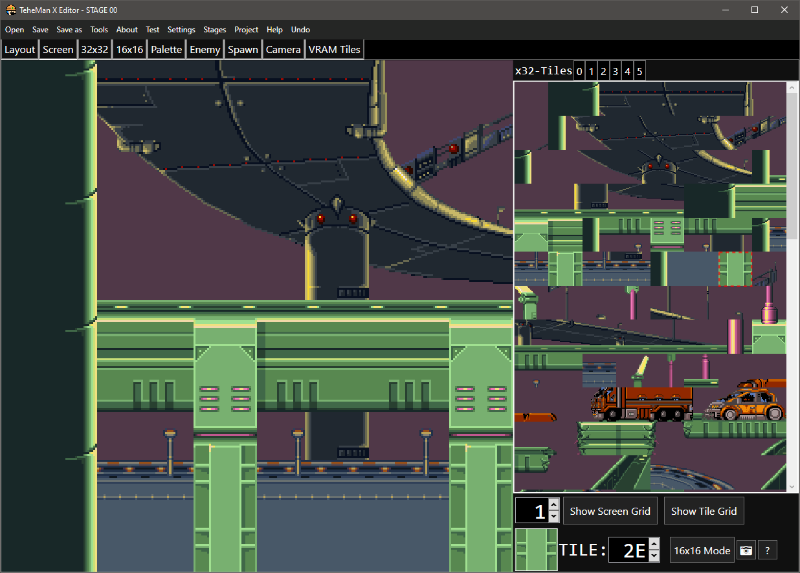
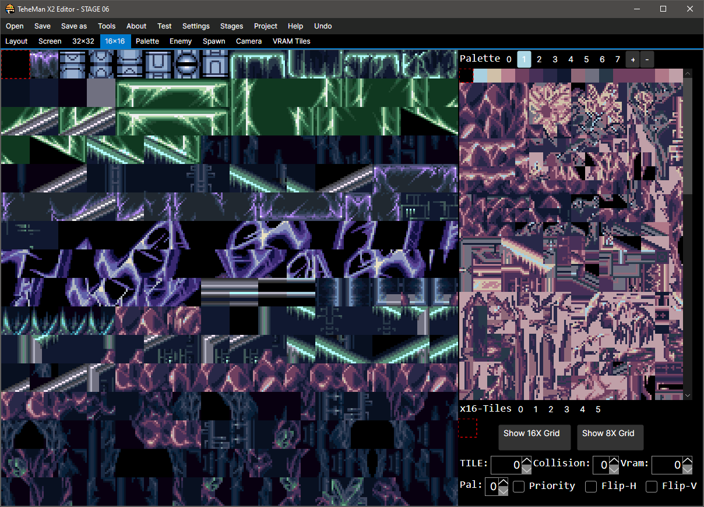
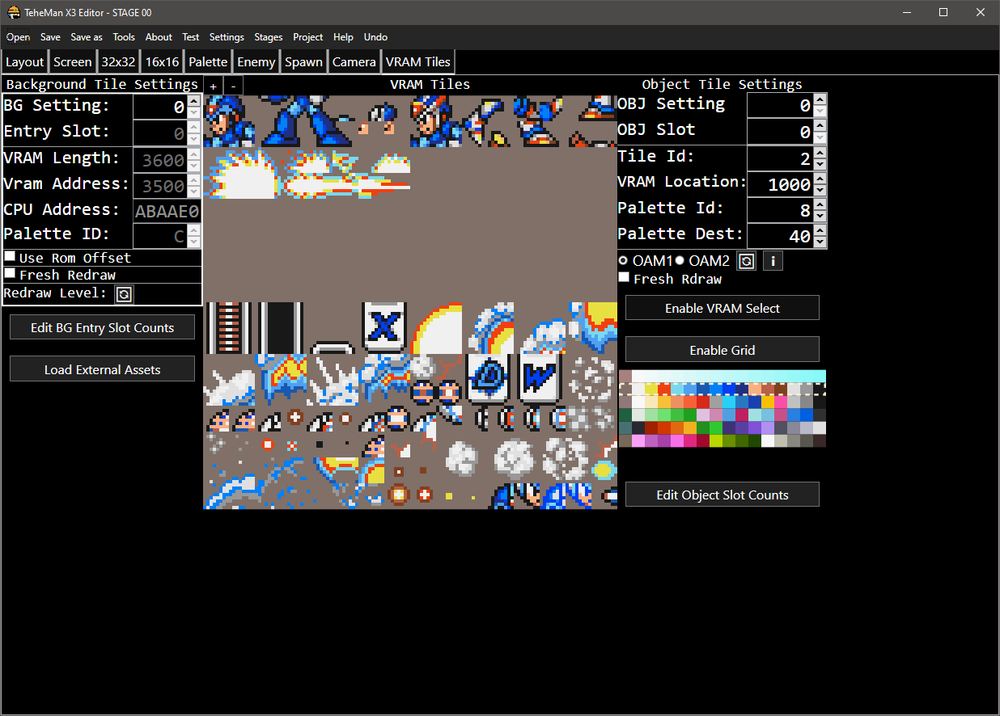
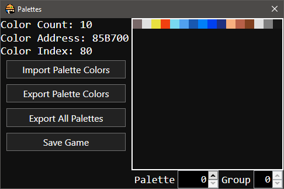

# TeheMan X Editor
A MegaMan X1-3 Level Editor for Windows , Linux & MacOS written in .NET C#.

## Compiling
1st your gonna need Visaul Studio after cloning the repro. After installing Visual Studio use the Visual Studio Install App
to install the .NET 8 SDK. Next , open the `TeheManX_Editor.sln` via Visual Studio and set the default project to
`TeheManX_Editor`. Then go to publish by right click on the C# Project in Solution explorer and simply publish 
for your respective operating system.

## Source Code
* [BGPalette.cs](TeheManX_Editor/BGPalette.cs) - a class represnting the swapped Palette Info
* [BGSetting.cs](TeheManX_Editor/BGSetting.cs) - a class represnting the swapped Background Tile Info
* [ByteArrayComparer.cs](TeheManX_Editor/ByteArrayComparer.cs) a class needed for using byte arrays in a dictionary
* [CameraTrigger.cs](TeheManX_Editor/CameraTrigger.cs) - a class represnting the Camera Triggers
* [Checkpoint.cs](TeheManX_Editor/Checkpoint.cs) - a class represnting the Checkpoint
* [Const.cs](TeheManX_Editor/Const.cs) - contains the class holding all the constants for all of the games
* [Enemy.cs](TeheManX_Editor/Enemy.cs) - a class represnting the Enemies
* [GameProject.cs](TeheManX_Editor/GameProject.cs) - the file containging the Game Project Settings
* [Layout.cs](TeheManX_Editor/Layout.cs) - contains the classes for saving the editors layout
* [Level.cs](TeheManX_Editor/Level.cs) - contains the methods needed to help draw and read various level data.
* [MaxRectsPacker.cs](TeheManX_Editor/MaxRectsPacker.cs) - a class representing the MaxReacts SSFF rectangle packer
* [ObjectIcon.cs](TeheManX_Editor/ObjectIcon.cs) - the class holding info on sprite info for the enemy tab
* [ObjectSetting.cs](TeheManX_Editor/ObjectSetting.cs) - a class represnting the swapped Object Tile Info
* [Program.cs](TeheManX_Editor/Program.cs) - your standard Program class for C# Projects.
* [Settings.cs](TeheManX_Editor/Settings.cs) - the file containning the Settings for the editor
* [SNES.cs](TeheManX_Editor/SNES.cs) - a static class containning various functions and tools used through out the editor
* [Undo.cs](TeheManX_Editor/Undo.cs) - the class representing an Undo

### [Config](TeheManX_Editor/Config)
Basic config files that are mostly worth ignoring

### [Forms](TeheManX_Editor/Forms)
A folder containning the the main xaml + C# code for all the tabs + windows

### [Resources](TeheManX_Editor/Resources)
The folder containning various images , patches , styles that need for compiling

## License

This project is licensed under the **MIT License**.  
See the `LICENSE` file for full details.